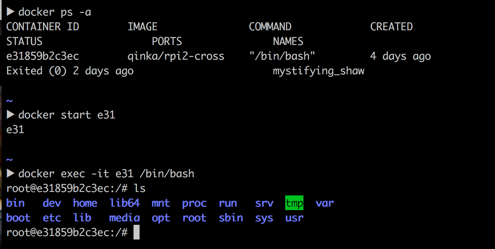
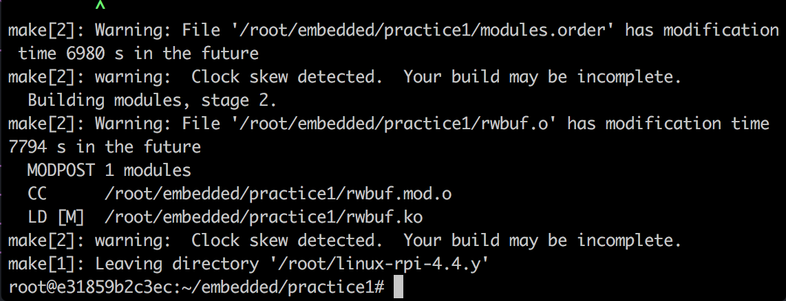
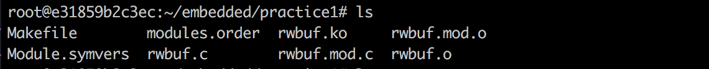
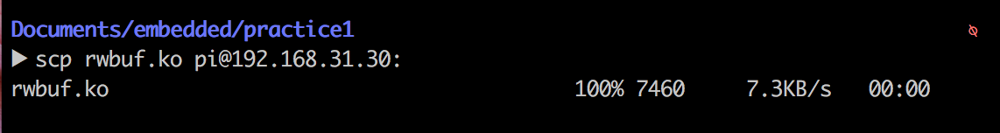
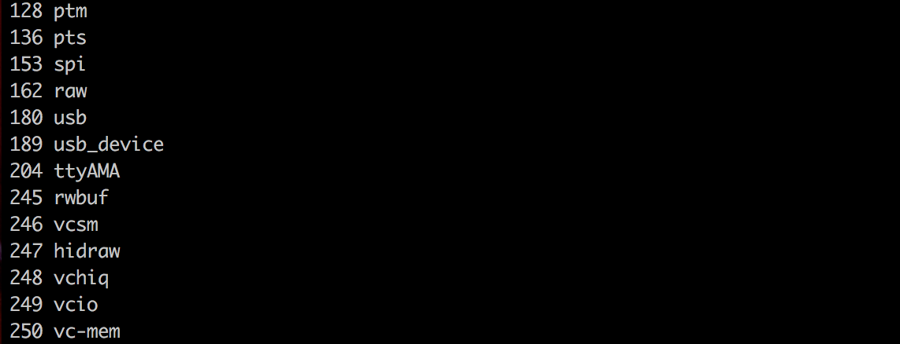
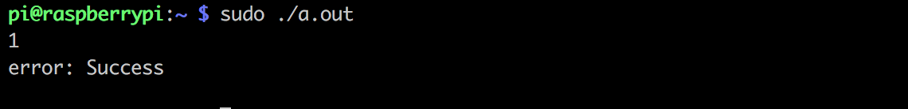
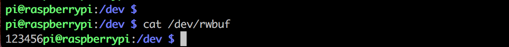
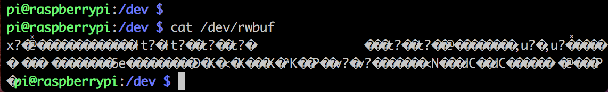

嵌入式系统设计实验报告 （一）

           
                

作者：康赣鹏

学号：14130140377

Email：1159838847@qq.com

教师：朱光明

 

##简单字符设备驱动
###一、实验目的
掌握简单字符设备驱动程序编写方法。

编写应用程序对驱动程序进行测试，学习应用程序与驱动程序之间的调用过程。

###二、实验要求

按实验内容编写驱动程序及测试程序

编译驱动程序和应用程序

在嵌入式设备上加载驱动程序并进行测试

###三、实验内容

写一个简单的字符设备驱动程序，要求：

* 定义一个全局结构指针，初始值为NULL，该数据结构中包含一个大小为1024的buffer和一个count整形变量
* 在open中对该全局结构进行NULL判断，为NULL则为其分配内存，并将buffer初始化为0，将count自加
* 在release中如果count为0，则释放，否则进行count自减
* 在read里面对该buffer进行读取
* 在write里面对该buffer进行赋值（任意赋值即可）
* 写测试程序进行测试

###四、实验步骤
参考《嵌入式系统设计》课程第04讲内容，根据实验内容要求设计编写驱动程序及应用程序

编译和加载驱动程序

运行测试程序进行驱动程序测试

卸载驱动程序

将本地文件目录挂载到docker中

利用docker中的交叉编译器对文件进行交叉编译

make结束后的得到的文件

将文件通过网线和路由器将文件发送到树莓派中

查看得rwbuf的主设备号

mknod make文件节点

测试安装的模块

open:对该全局结构进行NULL判断，当buffer为NULL时，则为其分配内存，并将buffer初始化为0，将count自加

	static int rwbuf_open(struct inode *inode, struct file *filep) {
	  if(count == 0 || buffer == NULL) {
	    buffer = kmalloc(BUFFER_SIZE,GFP_KERNEL);
	    if(buffer == NULL){
	      printk("cannot alloc\n");
	      return -1;
	    }
	    printk("alloc\n");
	    buf_size=BUFFER_SIZE;
	  }
	  try_module_get(THIS_MODULE);
	  ++ count;
	  return 0;
	}
	

close:在release中如果count为0，则释放，否则进行count自减

	static int rwbuf_close(struct inode *inode, struct file *filep)
	{
	  --count;
	  printk("close %u",count);
	  if(count == 0) {
	    if(buffer) {
	      kfree(buffer);
	      printk("free\n");
	      buffer = NULL;
	    }
	  }
	  module_put(THIS_MODULE);
	  return 0;
	}
	
write:在write里面对该buffer进行赋值，若count和文件指针来判断写入文件的大小
	
	static ssize_t rwbuf_write(struct file *filep, char *buf, size_t count, loff_t *f_pos)
	{
	  int len = -ENOMEM;
	  if(buffer) {
	    if (*f_pos < buf_size) {
	        len = count + *f_pos > buf_size ? buf_size - *f_pos : count;
	        copy_from_user(buffer + *f_pos,buf,len);
	    }
	    else {
	        len = count > buf_size ? buf_size  : count;
	        copy_from_user(buffer + *f_pos,buf,len);
	    }
	    *f_pos += len;
	  }
	  return len;
	}

read:在read里面对该buffer进行读取，若count和文件指针来判断读取内容的大小。
	
	static ssize_t rwbuf_read(struct file *filep, char *buf, size_t count, loff_t *f_pos)
	{
	  int len = 0;
	  if(buffer) {
	    if (*f_pos < buf_size) {
	        len = count + *f_pos > buf_size ? buf_size - *f_pos : count;
	        copy_to_user(buf,buffer + *f_pos,len);
	    }
	    *f_pos += len;
	  }
	  return len;
	}

加载模块

	static int init_ledc(void) {
	  buffer = NULL;
	  buf_size = 0;
	  count = 0;
	  printk("start!\n");
	  if(alloc_chrdev_region(&dev_id,0,1,"rwbuf")<0) {
	    printk("fail alloc devices\n");
	    return -1;
	  }
	  led_major = MAJOR(dev_id);
	  led_devs = (struct led_dev*)kzalloc(sizeof(struct led_dev),GFP_KERNEL);
	  if (led_devs == NULL) {
	    printk("fail to create devs");
	    return -1;
	  }
	  dev_t devno = MKDEV(led_major,0);
	  cdev_init(&led_devs->cdev,&rwbuf_fops);
	  led_devs->cdev.owner = THIS_MODULE;
	  if(cdev_add(&led_devs->cdev,devno,1)) {
	    printk("fail to add to devno");
	    return -31;
	  }
	  return 0;
	}

卸载模块
	
	static void exit_ledc(void) {
	  printk("exit!\n");
	  cdev_del(&led_devs->cdev);
	  unregister_chrdev_region(dev_id,1);
	  kfree(led_devs);
	  if(buffer) {
	    kfree(buffer);
	    printk("free");
	  }
	}

Makefile：

	obj-m:=rwbuf.o
	ledmod-y:=rwbuf.o
	
	
	KERNELBUILD:=../../linux-rpi-4.4.y/
	ccflags-y := -std=gnu99
	
	
	module: rwbuf.c
		$(MAKE) ARCH=arm -C $(KERNELBUILD)    M=$(shell pwd) modules ARCH=arm CROSS_COMPILE=armv7-rpi2-linux-gnueabihf-
	
	clean:
		rm -rf *.o *~ core .depend .*.cmd *.ko *.mod.c .tmp_versions

测试程序：

	#include <unistd.h>
	#include <stdio.h>
	
	#include <stdio.h>
	#include <stdlib.h>
	#include <signal.h>
	#include <unistd.h>
	#include <sys/types.h>
	#include <sys/stat.h>
	#include <fcntl.h>
	#include <linux/fs.h>
	
	int main() {
		int fd = open("/dev/rwbuf",O_RDWR);
		char buf[1024] = "123456";
		int k;
		write(fd,buf,1024);
		bzero(buf,1024);
		scanf("%d",&k);
		read(fd,buf,1024);
		perror("error");
		printf("%s\n",buf);
		close(fd);
	}

代码清单：

	#include <linux/uaccess.h>
	#include <linux/init.h>
	#include <linux/module.h>
	#include <linux/kernel.h>
	#include <linux/fs.h>
	#include <linux/slab.h>
	#include <linux/cdev.h>
	#include <linux/device.h>
	#include <linux/errno.h>
	
	#define BUFFER_SIZE (1024)
	
	struct led_dev {
	  struct cdev cdev;
	};
	
	static unsigned int count=0;
	static dev_t dev_id;
	static unsigned int led_major = 0;
	static struct led_dev* led_devs;
	
	static char * buffer;
	static unsigned long buf_size;
	
	static int rwbuf_open(struct inode *inode, struct file *filep) {
	  if(count == 0 || buffer == NULL) {
	    buffer = kmalloc(BUFFER_SIZE,GFP_KERNEL);
	    if(buffer == NULL){
	      printk("cannot alloc\n");
	      return -1;
	    }
	    printk("alloc\n");
	    buf_size=BUFFER_SIZE;
	  }
	  try_module_get(THIS_MODULE);
	  ++ count;
	  return 0;
	}
	
	// the close
	static int rwbuf_close(struct inode *inode, struct file *filep)
	{
	  --count;
	  printk("close %u",count);
	  if(count == 0) {
	    if(buffer) {
	      kfree(buffer);
	      printk("free\n");
	      buffer = NULL;
	    }
	  }
	  module_put(THIS_MODULE);
	  return 0;
	}
	
	static ssize_t rwbuf_write(struct file *filep, char *buf, size_t count, loff_t *f_pos)
	{
	  int len = -ENOMEM;
	  if(buffer) {
	    if (*f_pos < buf_size) {
	        len = count + *f_pos > buf_size ? buf_size - *f_pos : count;
	        copy_from_user(buffer + *f_pos,buf,len);
	    }
	    else {
	        len = count > buf_size ? buf_size  : count;
	        copy_from_user(buffer + *f_pos,buf,len);
	    }
	    *f_pos += len;
	  }
	  return len;
	}
	
	static ssize_t rwbuf_read(struct file *filep, char *buf, size_t count, loff_t *f_pos)
	{
	  int len = 0;
	  if(buffer) {
	    if (*f_pos < buf_size) {
	        len = count + *f_pos > buf_size ? buf_size - *f_pos : count;
	        copy_to_user(buf,buffer + *f_pos,len);
	    }
	    *f_pos += len;
	  }
	  return len;
	}
	
	
	// file operations
	static struct file_operations rwbuf_fops = {
	  open:    rwbuf_open,
	  release: rwbuf_close,
	  read:    rwbuf_read,
	  write:   rwbuf_write,
	};
	
	//// MODULE INIT
	static int init_ledc(void) {
	  buffer = NULL;
	  buf_size = 0;
	  count = 0;
	  printk("start!\n");
	  if(alloc_chrdev_region(&dev_id,0,1,"rwbuf")<0) {
	    printk("fail alloc devices\n");
	    return -1;
	  }
	  led_major = MAJOR(dev_id);
	  led_devs = (struct led_dev*)kzalloc(sizeof(struct led_dev),GFP_KERNEL);
	  if (led_devs == NULL) {
	    printk("fail to create devs");
	    return -1;
	  }
	  dev_t devno = MKDEV(led_major,0);
	  cdev_init(&led_devs->cdev,&rwbuf_fops);
	  led_devs->cdev.owner = THIS_MODULE;
	  if(cdev_add(&led_devs->cdev,devno,1)) {
	    printk("fail to add to devno");
	    return -31;
	  }
	  return 0;
	}
	
	//// MODULE CLEANUP
	static void exit_ledc(void) {
	  printk("exit!\n");
	  cdev_del(&led_devs->cdev);
	  unregister_chrdev_region(dev_id,1);
	  kfree(led_devs);
	  if(buffer) {
	    kfree(buffer);
	    printk("free");
	  }
	}
	
	module_init(init_ledc);
	module_exit(exit_ledc);
	
	MODULE_LICENSE("GPL");
	MODULE_AUTHOR("kangkang");
