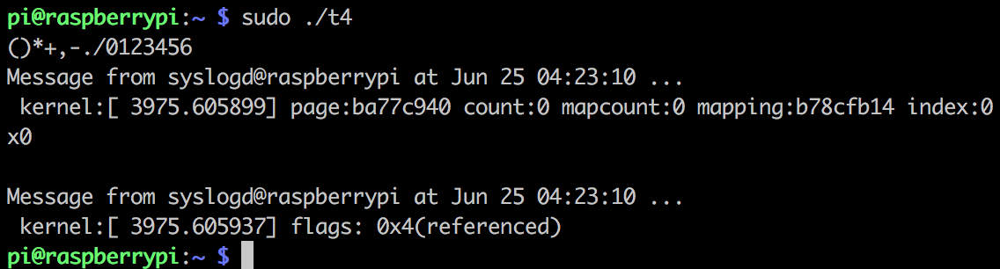

嵌入式系统设计实验报告 （四）

           
                

作者：康赣鹏

学号：14130140377

Email：1159838847@qq.com

教师：朱光明

 

##内存分配与内存映射
###一、实验目的

掌握字符设备驱动程序中利用nopage进行内存映射的方法。

掌握利用get_free_pages进行连续物理地址空间申请的方法。

###二、实验要求

按实验内容编写驱动程序及测试程序

编译驱动程序及测试程序

在嵌入式设备上加载驱动程序并进行测试

###三、实验内容

写一个简单的驱动程序，要求：

* 在加载驱动程序时利用get_free_pages函数申请一片64KB的连续物理地址空间；
* 利用nopage机制实现对申请到的64KB地址空间进行内存映射；
* 编写应用程序利用mmap进行内存映射，读写映射内存区域，通过打印输出观察具体每个页面实际进行内存映射的时机；
* 在卸载驱动程序时利用free_pages释放申请到的64KB空间

###四、实验步骤

参考《嵌入式系统设计》课程第09讲内容，根据实验内容要求设计编写驱动程序及应用程序

编译和加载驱动程序

运行应用程序进行驱动程序测试

卸载驱动程序

在docker上make成功

将文件通过网线和路由器将文件发送到树莓派中

动态加载模块 并查看当前模块

测试模块

Makefile：
	obj-m:=page.o
	ledmod-y:=page.o
	
	
	KERNELBUILD:=../../linux-rpi-4.4.y/
	ccflags-y := -std=gnu99
	
	
	module: page.c
		$(MAKE) ARCH=arm -C $(KERNELBUILD)    M=$(shell pwd) modules ARCH=arm CROSS_COMPILE=armv7-rpi2-linux-gnueabihf-
	
	clean:
		rm -rf *.o *~ core .depend .*.cmd *.ko *.mod.c .tmp_versions

测试程序：

	#include <unistd.h>
	#include <stdio.h>
	#include <string.h>
	#include <stdlib.h>
	#include <sys/mman.h>
	#include <stdio.h>
	#include <stdlib.h>
	#include <signal.h>
	#include <unistd.h>
	#include <sys/types.h>
	#include <sys/stat.h>
	#include <fcntl.h>
	#include <linux/fs.h>
	
	int main() {
	
	  char *buffer = NULL;
	
		int fd = open("/dev/page",O_RDWR);
	
	  buffer = (char*)mmap(0,524288,PROT_READ|PROT_WRITE,MAP_SHARED,fd,0);
	
		char buf[16] = "123456";
		bzero(buf,16);
	  int i = 0;
	  for(i=0;i<1;i++)
	  {
	    memcpy(buf,buffer+(unsigned int)(i*4096),15);
	    printf("%s",buf);
	  }
		close(fd);
	}

代码清单：

	#include <linux/uaccess.h>
	#include <linux/init.h>
	#include <linux/module.h>
	#include <linux/kernel.h>
	#include <linux/fs.h>
	#include <linux/slab.h>
	#include <linux/cdev.h>
	#include <linux/device.h>
	#include <linux/errno.h>
	#include <linux/mm.h>
	
	#define PAGE_COUNT (4)
	#define PAGE_T_SIZE ((1 << PAGE_COUNT) * PAGE_SIZE)
	
	struct led_dev {
	  struct cdev cdev;
	};
	
	
	//// Datas
	static unsigned int count=0;
	static dev_t dev_id;
	static unsigned int led_major = 0;
	static struct led_dev* led_devs;
	
	static char * pages;
	
	static int rwbuf_open(struct inode *inode, struct file *filep) {
	  if(count == 0 || pages == NULL) {
	    pages = __get_free_pages(GFP_KERNEL,PAGE_COUNT);
	    if(pages == NULL){
	      printk("can not alloc\n");
	      return -1;
	    }
	    printk("alloc\n");
	  }
	  int i = 0;
	  for (i=0;i<16;i++)
	  {
	    *(pages+i)=i+40;
	  }
	  try_module_get(THIS_MODULE);
	  ++ count;
	  return 0;
	}
	
	// the close
	static int rwbuf_close(struct inode *inode, struct file *filep)
	{
	  --count;
	  printk("close %u",count);
	  if(count == 0) {
	    if(pages) {
	      free_pages(pages,PAGE_COUNT);
	      printk("free\n");
	      pages = NULL;
	    }
	  }
	  module_put(THIS_MODULE);
	  return 0;
	}
	
	
	static ssize_t rwbuf_write(struct file *filep, char *buf, size_t count, loff_t *f_pos)
	{
	  int len = -ENOMEM;
	  if(pages) {
	    if (*f_pos < PAGE_T_SIZE) {
	        len = count + *f_pos > PAGE_T_SIZE ? PAGE_T_SIZE - *f_pos : count;
	        copy_from_user(pages + *f_pos,buf,len);
	    }
	    else {
	        len = count > PAGE_T_SIZE ? PAGE_T_SIZE : count;
	        copy_from_user(pages + *f_pos,buf,len);
	    }
	    *f_pos += len;
	  }
	  return len;
	}
	
	static ssize_t rwbuf_read(struct file *filep, char *buf, size_t count, loff_t *f_pos)
	{
	  int len = 0;
	  if(pages) {
	    if (*f_pos < PAGE_T_SIZE) {
	        len = count + *f_pos > PAGE_T_SIZE ? PAGE_T_SIZE - *f_pos : count;
	        copy_to_user(buf,pages + *f_pos,len);
	    }
	    *f_pos += len;
	  }
	  return len;
	}
	
	// vma
	static void rwbuf_vma_open(struct vm_area_struct *vma) {
	  printk("open, virt %lx, phys %lx\n",vma->vm_start, vma->vm_pgoff << PAGE_SHIFT);
	}
	
	static void rwbuf_vma_close(struct vm_area_struct *vma) {
	  printk("close\n");
	}
	
	static struct page* rwbuf_vma_fault(struct vm_area_struct *vma, struct vm_fault *vmf) {
	  struct page *page;
	  if (vmf->pgoff >= (1 << PAGE_COUNT))
	    return VM_FAULT_SIGBUS;
	  unsigned long viraddr = pages + (unsigned long)(vmf->virtual_address) - vma->vm_start  + (vma->vm_pgoff << PAGE_SHIFT);
	  page = virt_to_page(viraddr);
	  get_page(page);
	  if (vma->vm_file)
	    page->mapping = vma->vm_file->f_mapping;
	  else
	    printk(KERN_ERR "no mapping available\n");
	  vmf->page = page;
	  return 0;
	}
	
	static struct vm_operations_struct rwbuf_remap_vm_ops = {
	 open  : rwbuf_vma_open,
	 close : rwbuf_vma_close,
	 fault : rwbuf_vma_fault,
	};
	
	static int rwbuf_fault_mmap(struct file *filp, struct vm_area_struct *vma) {
	  unsigned long offset = vma -> vm_pgoff << PAGE_SHIFT;
	  if(offset >= __pa(high_memory) || (filp->f_flags & O_SYNC))
	    vma->vm_flags |= VM_IO;
	  vma->vm_flags |= (VM_DONTEXPAND | VM_DONTDUMP);
	
	  vma->vm_ops = &rwbuf_remap_vm_ops;
	  rwbuf_vma_open(vma);
	  return 0;
	}
	
	
	
	// file operations
	static struct file_operations rwbuf_fops = {
	 open:    rwbuf_open,
	 release: rwbuf_close,
	 read:    rwbuf_read,
	 write:   rwbuf_write,
	 mmap:    rwbuf_fault_mmap,
	};
	
	//// MODULE INIT
	static int init_ledc(void) {
	  pages = NULL;
	  count = 0;
	  printk("start!\n");
	  if(alloc_chrdev_region(&dev_id,0,1,"page")<0) {
		printk("fail alloc devices\n");
		return -1;
	  }
	  led_major = MAJOR(dev_id);
	  led_devs = (struct led_dev*)kzalloc(sizeof(struct led_dev),GFP_KERNEL);
	  if (led_devs == NULL) {
	    printk("fail to create devs");
	    return -1;
	  }
	  dev_t devno = MKDEV(led_major,0);
	  cdev_init(&led_devs->cdev,&rwbuf_fops);
	  led_devs->cdev.owner = THIS_MODULE;
	  if(cdev_add(&led_devs->cdev,devno,1)) {
	    printk("fail to add to devno");
	    return -31;
	  }
	  return 0;
	}
	
	//// MODULE CLEANUP
	static void exit_ledc(void) {
	  printk("exit!\n");
	  cdev_del(&led_devs->cdev);
	  unregister_chrdev_region(dev_id,1);
	  kfree(led_devs);
	  if(pages) {
	    free_pages(pages,PAGE_COUNT);
	    printk("free");
	  }
	}
	
	module_init(init_ledc);
	module_exit(exit_ledc);
	
	MODULE_LICENSE("GPL");
	MODULE_AUTHOR("kangkang");
